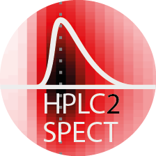

#  MASH-FRET

*HPLC2Spect* is a Matlab based analysis tool for 2D HPLC chromatograms Dionex Ultimate-3000 HPLC system. Chromatograms are generated by either a fluorescence or a UV/Vis 3D detector array, giving access to the full absorption and excitation/emission spectrum at all retention time points.

## Load a 2D-chromatogram
Files can be loaded in two different ways:
- automatic detection of wavelengths in the header 
- manual import of the numeric array and specification of the wavelength range

### Automatic wavelength detection
This import option requires the files to be formatted as follows (see also file in folder examples):

| time | integration time | 500 | 501 | 502 | etc. |
| --- | --- | --- | --- | --- | --- |
| 0.01 | 0.2 | 1000 | 1240 | 1050 | etc. |

> Note this format is used by the Dionex Ultimate-3000 series. Important is the wavelength information in the header. The second column is not required. The column delimiter as well as the position of the time and wavelength column can be set under `Files->Options`

Load one or multiple files by going to `File->Open File(s)`. The imported files will display in the dropdown list.

### Manual import
Go to `File->Options` to set the row range of the numeric array, the time column and the wavelength range. Then import the files that have the same settings by going to `File->Open File(s)`

## Evaluate a 2D-chromatogram

### Define peak maximum
You may either find the peak maximum within a user-defined subrange of the chromatogram (`define area`) or manually select a specific point on the chromatogram (`manual`).

To compare retention times and wavelengths you may lock the position of the current peak by ticking the *lock position* radiobutton. A gray solid crosshair will mark the location of the selected peak (this selection will remain active, even if you change between chromatograms).

## Saving chromatogram and traces

### Cropping and saving the chromatogram
You may also choose to crop the 2D chromatogram (e.g. to get rid of highly intense scattering peaks). For this purpose go to `Processing->Crop Chromatogram` and select a subrange for the spectrum and/or a new time interval. Pressing the `export` button will save the cropped chromatogram as an ASCII file to a directory of choice.

### Extracting the spectrum and retention trace
To save the current spectrum and rentention trace as ASCII files, go to `Processing->Extract Trace/Spectrum`
 
### Saving chromatogram as image
To save a snapshot of the chromatogram and the traces to a PNG file go to `File->Save Image`

## Getting Help
The Help Menu directs you to this README page.